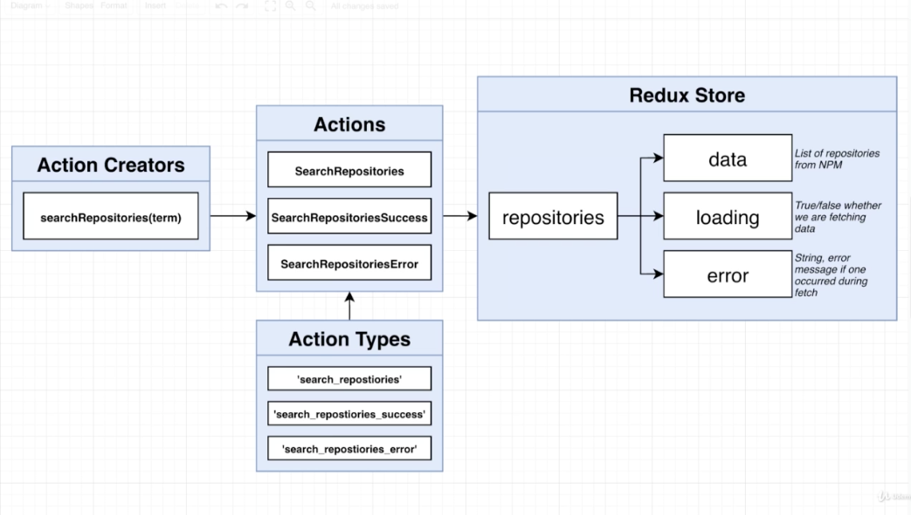
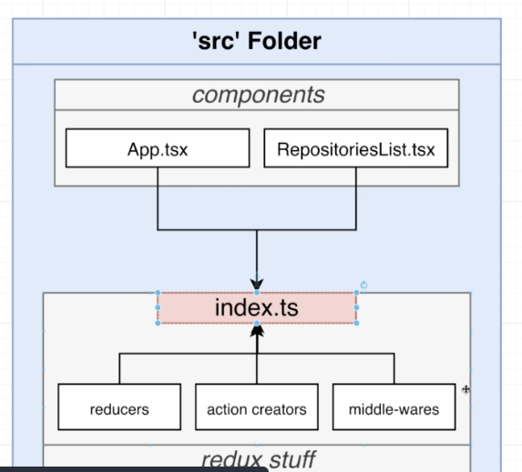
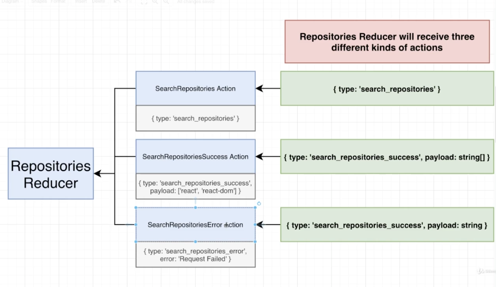

# React with Redux & TypeScript

- npm install --save-exact @types/react-redux@7.1.15 axios@0.21.1 react-redux@7.2.2 redux@4.0.5 redux-thunk@2.3.0

## Redux
- Call NPM packages 'repositories'
- Redux Store & Actions: 

    
    
    